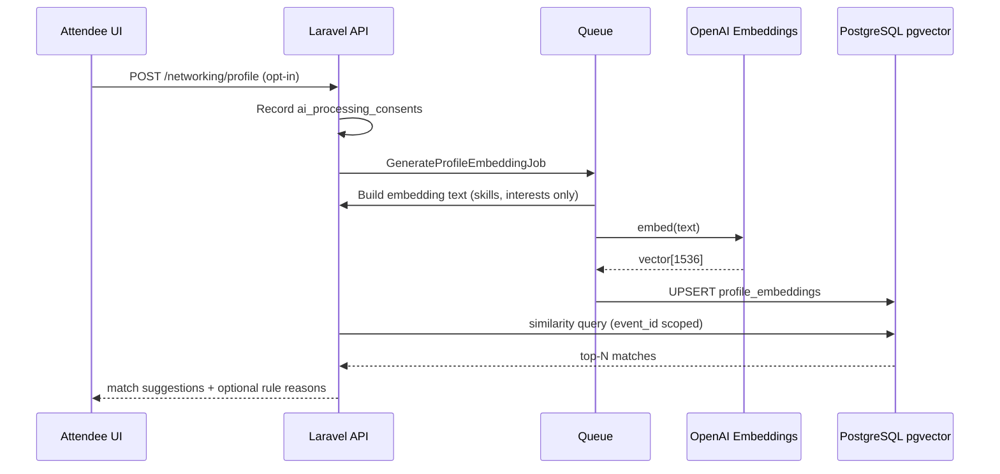

# AI Matching Module — Architecture Stub

> **Status:** Planning stub for Part 2 §2.1. Not implemented.  
> **Parent:** [platform-roadmap-part2.md](../platform-roadmap-part2.md)

## Purpose

Suggest relevant connections between event participants (attendees, mentors, sponsor reps) using structured profile data and optional vector similarity.

## Bounded context

```
Services/Domain/Networking/
  AttendeeProfileService      # opt-in profile CRUD
  ProfileTagExtractionService # from question_answers
  MatchSuggestionService    # rules + vector ranking

Infrastructure/AI/
  EmbeddingClientInterface
  OpenAiEmbeddingClient       # text-embedding-3-small
  GenerateProfileEmbeddingJob
```

## Data flow



## Schema (planned)

| Table | Key columns |
|-------|-------------|
| `profile_embeddings` | `attendee_id`, `event_id`, `model`, `embedding vector(1536)` |
| `match_suggestions` | `event_id`, `source_attendee_id`, `target_attendee_id`, `score`, `status` |
| `ai_processing_consents` | `user_id`, `scope`, `granted_at`, `revoked_at` |

## MVP without AI

Ship **tag overlap matching** first (shared answers to marked registration questions). Enable pgvector when opt-in rate > threshold.

## Security checklist

- [ ] Opt-in gate before any embedding job
- [ ] Exclude PII fields from embedding payload (email, phone, address)
- [ ] Tenant-scoped queries (`WHERE event_id = ?`)
- [ ] Cascade delete embeddings on attendee removal
- [ ] Config flag `AI_MATCHING_ENABLED` default false for self-hosters

## Open questions

1. Match mentors to teams — separate rubric or same vector space?
2. Store embeddings per `attendee_id` vs `user_id` for multi-event users?
3. Rate limit: max embedding refreshes per day?

## Next implementation steps (when prioritized)

1. Migration: `profile_embeddings`, consent table, attendee networking columns
2. `ProfileTagExtractionService` unit tests with fixture `question_answers`
3. Rule-based `MatchSuggestionService` + API route
4. pgvector extension + embedding job (feature-flagged)
