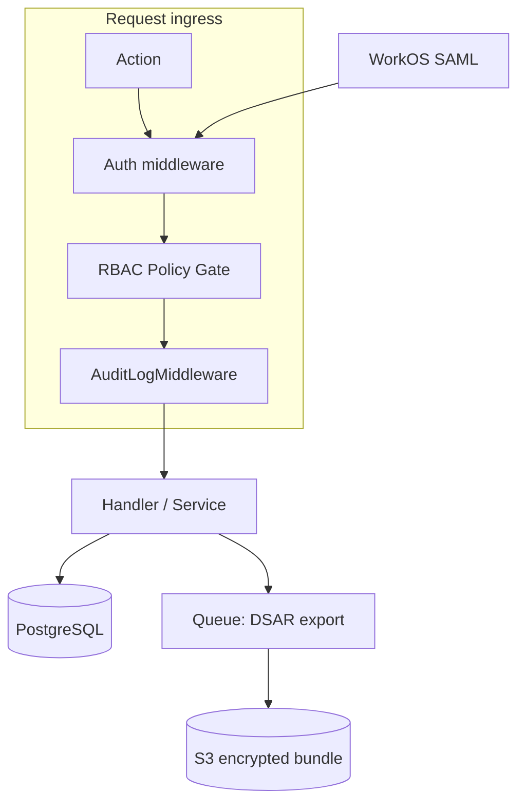

# Enterprise & Compliance Module — Architecture One-Pager

> **Roadmap context:** [Part 2 §2.12](../platform-roadmap-part2.md#212-enterprise--compliance)

**Product:** Event Hosting (Hi.Events fork)  
**Status:** Strategic design — not implemented

---

## Purpose

Unlock enterprise and regulated-industry customers by extending today's **account-scoped multi-tenancy** with granular permissions, comprehensive audit trails, and GDPR/CCPA self-service — without forking the monolith.

---

## What exists today

| Capability | State | Location |
|------------|-------|----------|
| Account isolation | ✅ Strong | `accounts.account_id` on all child entities |
| User ↔ account membership | ✅ Strong | `account_users` pivot |
| Fixed roles (3) | ⚠️ Partial | `Role` enum: `SUPERADMIN`, `ADMIN`, `ORGANIZER` |
| Order audit trail | ⚠️ Partial | `order_audit_logs` (order events only) |
| Superadmin impersonation | ✅ Strong | Admin actions with session flag |
| Marketing consent | ⚠️ Partial | `users.marketing_opted_in_at`, checkout opt-in |
| Cookie consent (tracking) | ⚠️ Partial | `CookieConsentBanner` for organizer pixels |
| JWT authentication | ✅ Strong | API auth; no SAML |

**Gap:** No custom roles (judge, mentor, volunteer), no admin-wide audit log, no DSAR export/delete workflow, no SSO.

---

## Target architecture



### Module boundaries (Laravel monolith)

| Component | Responsibility |
|-----------|----------------|
| `RbacService` | Resolve user permissions from `role_permissions` |
| `AuditLogMiddleware` | Append-only `admin_audit_logs` on mutating routes |
| `DsarService` | Data Subject Access Request: export ZIP, erasure/anonymize |
| `RetentionService` | Scheduled purge per `data_retention_policies` |
| `SsoService` | WorkOS/Auth0 SAML ACS callback → link or provision user |

---

## Data model (new / extended)

```sql
-- Extend account_users: migrate role string → role_id FK
CREATE TABLE roles (
    id BIGSERIAL PRIMARY KEY,
    account_id BIGINT NULL REFERENCES accounts(id),  -- NULL = system role
    name VARCHAR(100) NOT NULL,
    is_system BOOLEAN DEFAULT FALSE,
    created_at TIMESTAMP, updated_at TIMESTAMP
);

CREATE TABLE permissions (
    id BIGSERIAL PRIMARY KEY,
    key VARCHAR(100) UNIQUE NOT NULL,  -- e.g. events.delete, messages.send
    description TEXT
);

CREATE TABLE role_permissions (
    role_id BIGINT REFERENCES roles(id),
    permission_id BIGINT REFERENCES permissions(id),
    PRIMARY KEY (role_id, permission_id)
);

CREATE TABLE admin_audit_logs (
    id BIGSERIAL PRIMARY KEY,
    account_id BIGINT NOT NULL,
    user_id BIGINT NULL,
    action VARCHAR(100) NOT NULL,
    entity_type VARCHAR(100) NULL,
    entity_id BIGINT NULL,
    ip_address INET NULL,
    user_agent TEXT NULL,
    payload JSONB NULL,
    created_at TIMESTAMP NOT NULL
);

CREATE TABLE dsar_requests (
    id BIGSERIAL PRIMARY KEY,
    user_id BIGINT NOT NULL REFERENCES users(id),
    type VARCHAR(20) NOT NULL,  -- EXPORT | ERASURE
    status VARCHAR(20) NOT NULL,
    completed_at TIMESTAMP NULL,
    download_url TEXT NULL,
    expires_at TIMESTAMP NULL,
    created_at TIMESTAMP NOT NULL
);

CREATE TABLE data_retention_policies (
    id BIGSERIAL PRIMARY KEY,
    account_id BIGINT NOT NULL REFERENCES accounts(id),
    entity_type VARCHAR(100) NOT NULL,
    retain_days INT NOT NULL,
    created_at TIMESTAMP, updated_at TIMESTAMP
);
```

**System roles (seed):** Superadmin, Account Admin, Organizer — map to existing `Role` enum values for backward compatibility.

**Event-scoped roles (P2):** Judge, Mentor, Volunteer — scoped via `event_user_roles` pivot when hackathon/judging modules land.

---

## API surface (planned)

| Method | Path | Permission |
|--------|------|------------|
| `GET` | `/accounts/{id}/roles` | `roles.manage` |
| `POST` | `/accounts/{id}/users/{uid}/role` | `users.manage` |
| `GET` | `/accounts/{id}/audit-logs` | `audit.view` |
| `POST` | `/users/me/data-export` | self |
| `POST` | `/users/me/data-erasure` | self |
| `POST` | `/auth/saml/acs` | public (SSO callback) |

---

## Build vs Buy

| Item | Decision |
|------|----------|
| SAML SSO | **Integrate** WorkOS (fastest enterprise SSO) |
| SOC 2 evidence | **Buy** Vanta/Drata; implement technical controls in-app |
| Status page | **Integrate** Instatus or Better Stack |
| Audit log storage | **Build** PostgreSQL append-only; archive to S3 after 90 days |
| DSAR export | **Build** queued job assembling JSON/CSV from user-linked tables |

---

## Phased delivery

| Phase | Deliverable | Effort |
|-------|-------------|--------|
| P0 | `roles`/`permissions` + migrate `account_users` + Policy gates | L |
| P0 | `admin_audit_logs` middleware on all admin Actions | M |
| P1 | DSAR export + erasure workflow | L |
| P1 | WorkOS SAML for account SSO | M |
| P1 | Data retention scheduled jobs | M |
| P2 | Event-scoped roles (judge, mentor) | M |
| P2 | SOC 2 control matrix + evidence automation | XL |

---

## Security notes

- Audit logs are **append-only**; no soft delete.
- DSAR export URLs expire in 72 hours; encrypted at rest in S3.
- Erasure anonymizes PII in `users`, `attendees`, `orders` where legally permissible; retain financial records per tax law.
- SSO users get `password = null`; local login disabled when SSO enforced per account.

---

## Dependencies

- Part 2 roadmap §2.12
- Part 1 account spine (`accounts`, `account_users`)
- Existing `order_audit_logs` pattern for field naming consistency
