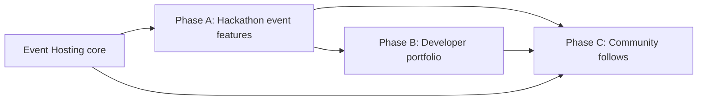

# Platform Roadmap — Part 1 Foundation

> **Next:** [Part 2 — High-End Features (2.1–2.15)](./platform-roadmap-part2.md) · [Enterprise compliance module](./architecture/enterprise-compliance-module.md)

**Product direction:** Next-Generation Event & Developer Portfolio Platform (Devfolio + Luma capabilities on top of **Event Hosting**, the Hi.Events fork).

**Scope:** Part 1 covers event/hackathon baseline (1.1), developer portfolio (1.2), and community (1.3). This document is the phased implementation plan for **new domains only** — existing Event Hosting entities (accounts, organizers, events, products, orders, attendees) are assumed stable.

**Dev environment:** Native Windows (PostgreSQL + `php artisan serve` + `yarn dev:csr`). Docker is optional, not required.

---

## Current baseline (what already works)

Event Hosting today is a production-grade **ticketing + organizer** platform:

| Area | Maturity | Key paths |
|------|----------|-----------|
| Event creation & onboarding | Strong | `frontend/src/components/routes/welcome/`, `GettingStarted/` |
| Event/organizer theming | Strong | `HomepageDesigner/`, `OrganizerHomepageDesigner/`, `homepage_theme_settings` |
| Tickets & checkout | Strong | `products`, `ProductWidget`, Stripe Connect |
| Waitlist (sold-out products) | Strong | `waitlist_entries`, `SoldOutWaitlist/` |
| QR check-in | Strong | `CheckInList`, `QrScanner`, `attendee_check_ins` |
| Registration questions | Strong | `questions`, `QuestionForm` (custom forms at checkout) |
| Organizer public pages | Strong | `/events/:organizerId/:organizerSlug`, `OrganizerHomepage/` |
| Embed widget | Strong | `WidgetEditor/`, `/widget/:eventId`, `src/embed/widget.js` |
| Email + realtime organizer alerts | Partial | `messages`, `EventNotificationsContext` |

**Honest assessment:** ~**70% of 1.2** and much of **1.3 social graph** are **net-new product areas**. Part 1.1 has the highest overlap (~60–75% for core ticketing events; ~20% for hackathon-specific flows).

---

## Gap summary (Part 1 bullets)

See the full gap table in the Part 1 analysis deliverable. Highlights:

- **Missing entirely:** agenda/sessions, speakers, hackathon submissions, participant teams, dev portfolios, projects, badges, followers, follower notifications.
- **Partial:** event wizard (onboarding ≠ hackathon wizard), galleries (cover images only), GitHub (static social link on organizer settings), calendars (per-event add-to-calendar only), teams (staff invites only).

---

## Architecture principles (extend, don't rewrite)

1. **Keep tenancy:** `Account → Organizer → Event` remains the spine for paid/hosted events.
2. **Extend `users` for portfolio:** 1:1 `developer_profiles` table (do not bloat `users` or break auth).
3. **Extend community via follows:** polymorphic-lite `community_follows` targeting organizers (Phase C) and developer profiles (Phase B/C).
4. **Hackathon as event mode:** prefer `events.attributes` or `event_settings` flags before new top-level entities; add `event_sessions`, `event_speakers`, `hackathon_submissions` only when parity work proves insufficient.
5. **Follow Hi.Events DDD flow:** Action → Handler → Service → Repository; run `php artisan generate-domain-objects` after migrations.

---

## Phased plan

### Phase A — Parity gaps & hackathon-ready events (4–6 weeks)

**Goal:** Make Event Hosting credible for tech/hackathon organizers without building Devfolio yet.

| Work item | Effort | Depends on | Notes |
|-----------|--------|------------|-------|
| Event mode flag (`HACKATHON` / `STANDARD`) on settings | S | — | Drives UI nav + public page sections |
| Agenda: `event_sessions` CRUD + public schedule tab | M | Event mode | title, start/end, track, room, speaker_ids JSON |
| Speakers: `event_speakers` + link from sessions | M | — | name, bio, photo, socials; reuse `images` pattern |
| Hackathon registration track via product categories | S | — | Already have categories + questions |
| Participant teams (`hackathon_teams`, `hackathon_team_members`) | L | Event mode | Separate from account staff `account_users` |
| Submissions v1 (`hackathon_submissions`) | L | Teams | title, description, repo URL, status enum |
| Post-event gallery (`event_gallery_images` or extend `images`) | M | — | Multi-image public gallery |
| Event wizard: hackathon checklist in Getting Started | S | Event mode | Extend existing checklist, not new wizard framework |
| Docs: "what works today" for organizers | S | — | Link from Getting Started |

**Schema sketches (Phase A — new tables):**

```sql
-- Event settings extension (migration columns, not new table)
-- event_settings.event_mode VARCHAR(50) DEFAULT 'STANDARD'
-- event_settings.hackathon_settings JSONB NULL  -- submission deadline, max team size, etc.

CREATE TABLE event_speakers (
    id BIGSERIAL PRIMARY KEY,
    event_id BIGINT NOT NULL REFERENCES events(id) ON DELETE CASCADE,
    name VARCHAR(255) NOT NULL,
    title VARCHAR(255) NULL,
    bio TEXT NULL,
    social_links JSONB NULL,
    sort_order INT DEFAULT 0,
    created_at TIMESTAMP, updated_at TIMESTAMP, deleted_at TIMESTAMP
);

CREATE TABLE event_sessions (
    id BIGSERIAL PRIMARY KEY,
    event_id BIGINT NOT NULL REFERENCES events(id) ON DELETE CASCADE,
    title VARCHAR(255) NOT NULL,
    description TEXT NULL,
    starts_at TIMESTAMP NOT NULL,
    ends_at TIMESTAMP NOT NULL,
    track VARCHAR(100) NULL,
    location_label VARCHAR(255) NULL,
    speaker_ids JSONB NULL,  -- [event_speakers.id]
    sort_order INT DEFAULT 0,
    created_at TIMESTAMP, updated_at TIMESTAMP, deleted_at TIMESTAMP
);

CREATE TABLE hackathon_teams (
    id BIGSERIAL PRIMARY KEY,
    event_id BIGINT NOT NULL REFERENCES events(id) ON DELETE CASCADE,
    name VARCHAR(255) NOT NULL,
    invite_code VARCHAR(32) UNIQUE NOT NULL,
    captain_user_id BIGINT NULL REFERENCES users(id),
    created_at TIMESTAMP, updated_at TIMESTAMP, deleted_at TIMESTAMP
);

CREATE TABLE hackathon_team_members (
    id BIGSERIAL PRIMARY KEY,
    team_id BIGINT NOT NULL REFERENCES hackathon_teams(id) ON DELETE CASCADE,
    user_id BIGINT NULL REFERENCES users(id),
    email VARCHAR(255) NULL,
    role VARCHAR(50) DEFAULT 'MEMBER',
    joined_at TIMESTAMP,
    UNIQUE(team_id, user_id)
);

CREATE TABLE hackathon_submissions (
    id BIGSERIAL PRIMARY KEY,
    event_id BIGINT NOT NULL REFERENCES events(id) ON DELETE CASCADE,
    team_id BIGINT NOT NULL REFERENCES hackathon_teams(id) ON DELETE CASCADE,
    title VARCHAR(255) NOT NULL,
    description TEXT NULL,
    repository_url VARCHAR(512) NULL,
    demo_url VARCHAR(512) NULL,
    status VARCHAR(50) DEFAULT 'DRAFT',
    submitted_at TIMESTAMP NULL,
    created_at TIMESTAMP, updated_at TIMESTAMP, deleted_at TIMESTAMP
);
```

---

### Phase B — Developer portfolio module (5–8 weeks)

**Goal:** Public developer identity + project showcase (Devfolio core), linked to hackathon participation.

| Work item | Effort | Depends on | Notes |
|-----------|--------|------------|-------|
| **`developer_profiles` foundation** (scaffolded) | S | Phase A teams | username, bio, public flag, GitHub username |
| Public route `/u/:username` | M | Profiles | SSR page, SEO, theme |
| **`developer_projects`** CRUD | M | Profiles | title, description, stack, links, cover image |
| Link submissions → portfolio projects | M | Phase A submissions | Opt-in "publish to portfolio" |
| GitHub OAuth + repo import | L | Profiles | Defer full sync; start with manual URL + optional OAuth |
| Skill tags & searchable directory | M | Profiles | |
| Achievement **badges** (`developer_badges`) | M | Events + submissions | "Participated in X", "Winner Y" — not UI Badge components |

**Schema sketches (Phase B — new tables):**

```sql
-- SCAFFOLDED in this session (migration 2026_06_06_000001)
CREATE TABLE developer_profiles (
    id BIGSERIAL PRIMARY KEY,
    user_id BIGINT NOT NULL UNIQUE REFERENCES users(id) ON DELETE CASCADE,
    username VARCHAR(64) NOT NULL UNIQUE,
    headline VARCHAR(255) NULL,
    bio TEXT NULL,
    github_username VARCHAR(255) NULL,
    website_url VARCHAR(512) NULL,
    location VARCHAR(255) NULL,
    is_public BOOLEAN DEFAULT FALSE,
    metadata JSONB NULL,
    created_at TIMESTAMP, updated_at TIMESTAMP, deleted_at TIMESTAMP
);

CREATE TABLE developer_projects (
    id BIGSERIAL PRIMARY KEY,
    developer_profile_id BIGINT NOT NULL REFERENCES developer_profiles(id) ON DELETE CASCADE,
    title VARCHAR(255) NOT NULL,
    slug VARCHAR(128) NOT NULL,
    summary TEXT NULL,
    description TEXT NULL,
    tech_stack JSONB NULL,
    repository_url VARCHAR(512) NULL,
    demo_url VARCHAR(512) NULL,
    hackathon_submission_id BIGINT NULL REFERENCES hackathon_submissions(id),
    is_public BOOLEAN DEFAULT TRUE,
    sort_order INT DEFAULT 0,
    created_at TIMESTAMP, updated_at TIMESTAMP, deleted_at TIMESTAMP,
    UNIQUE(developer_profile_id, slug)
);

CREATE TABLE developer_badges (
    id BIGSERIAL PRIMARY KEY,
    developer_profile_id BIGINT NOT NULL REFERENCES developer_profiles(id) ON DELETE CASCADE,
    badge_type VARCHAR(50) NOT NULL,
    label VARCHAR(255) NOT NULL,
    source_event_id BIGINT NULL REFERENCES events(id),
    awarded_at TIMESTAMP NOT NULL,
    metadata JSONB NULL
);
```

**Post-scaffold backend steps:**

```bash
cd backend
php artisan migrate
php artisan generate-domain-objects
# Then add Handler/Action/API routes following existing patterns
```

---

### Phase C — Community social graph (4–6 weeks)

**Goal:** Luma-like discovery — follow organizers/developers, calendar feeds, notifications.

| Work item | Effort | Depends on | Notes |
|-----------|--------|------------|-------|
| **`community_follows` foundation** (scaffolded) | S | — | Follow organizers first, then developer profiles |
| Follow/unfollow API + auth | M | Follows table | |
| Follower count on organizer homepage | S | API | |
| **Calendar feed:** iCal/webcal for followed organizers | L | Follows | Aggregate public events |
| **Calendar embed widget** for organizer | M | Existing widget pattern | New widget type `calendar` |
| Follower notifications (email digest + in-app) | L | Follows | Extend `outgoing_messages` or new `user_notifications` |
| Public community discovery page | M | Profiles + follows | Optional `/discover` |

**Schema sketches (Phase C — new tables):**

```sql
-- SCAFFOLDED in this session (migration 2026_06_06_000002)
CREATE TABLE community_follows (
    id BIGSERIAL PRIMARY KEY,
    follower_user_id BIGINT NOT NULL REFERENCES users(id) ON DELETE CASCADE,
    target_type VARCHAR(50) NOT NULL,  -- ORGANIZER | DEVELOPER_PROFILE
    target_id BIGINT NOT NULL,
    created_at TIMESTAMP NOT NULL,
    UNIQUE(follower_user_id, target_type, target_id)
);

CREATE TABLE user_notification_preferences (
    id BIGSERIAL PRIMARY KEY,
    user_id BIGINT NOT NULL UNIQUE REFERENCES users(id) ON DELETE CASCADE,
    email_digest_enabled BOOLEAN DEFAULT TRUE,
    new_event_from_followed BOOLEAN DEFAULT TRUE,
    created_at TIMESTAMP, updated_at TIMESTAMP
);

CREATE TABLE user_notifications (
    id BIGSERIAL PRIMARY KEY,
    user_id BIGINT NOT NULL REFERENCES users(id) ON DELETE CASCADE,
    type VARCHAR(50) NOT NULL,
    title VARCHAR(255) NOT NULL,
    body TEXT NULL,
    read_at TIMESTAMP NULL,
    metadata JSONB NULL,
    created_at TIMESTAMP NOT NULL
);
```

---

## Dependencies graph



---

## Rebrand note (Event Hosting)

User-facing strings should say **Event Hosting** (not Hi.Events) over time. Do this incrementally via Lingui (`t` / `Trans`) when touching files — not a big-bang README rewrite.

Config touchpoints: `APP_NAME`, email templates, `PoweredByFooter`, widget `data-hievents-*` attributes (keep technical IDs stable; alias in docs).

---

## What works today (1.1 quick reference)

Use these as-is for standard events; extend for hackathons in Phase A.

1. **Create organizer + event:** `/welcome` flow → `CreateEvent` → `/manage/event/:id/getting-started`
2. **Theme event page:** Event → Homepage Designer
3. **Tickets:** Event → Tickets & Products (+ waitlist in product settings)
4. **Registration fields:** Event → Registration Questions
5. **Check-in:** Event → Check-In Lists → QR scanner
6. **Embed sales:** Event → Widget Embed
7. **Public organizer hub:** `/events/:organizerId/:organizerSlug`
8. **Public event page:** `/event/:eventId/:eventSlug` or `/e/:eventId/:eventSlug`

No known blocking bugs were found in the core create-event path during this analysis; local setup requires PHP on PATH and PostgreSQL running (see native dev notes above).

---

## Part 2 recommendation (next prompt)

Build in this order:

1. **Run migrations + generate domain objects** for scaffolded tables.
2. **Phase A first vertical slice:** `event_settings.event_mode` + `event_speakers` + `event_sessions` with admin UI and public schedule section on `EventHomepage`.
3. **Developer profile MVP:** CRUD API + `/manage/profile` settings + public `/u/:username` (read-only).
4. **Follow organizer:** wire `community_follows` to organizer public page with authenticated follow button.

Defer GitHub OAuth, badge automation, and calendar embed until sessions/speakers and profiles are live.

---

## Files added in Part 1 foundation session

| File | Purpose |
|------|---------|
| `backend/database/migrations/2026_06_06_000001_create_developer_profiles_table.php` | Portfolio root entity |
| `backend/database/migrations/2026_06_06_000002_create_community_follows_table.php` | Social graph root entity |
| `backend/app/Models/DeveloperProfile.php` | Eloquent model |
| `backend/app/Models/CommunityFollow.php` | Eloquent model |
| `backend/app/Repository/Interfaces/DeveloperProfileRepositoryInterface.php` | Repository contract |
| `backend/app/Repository/Interfaces/CommunityFollowRepositoryInterface.php` | Repository contract |
| `backend/app/Repository/Eloquent/DeveloperProfileRepository.php` | Stub (pre–domain-object generation) |
| `backend/app/Repository/Eloquent/CommunityFollowRepository.php` | Stub (pre–domain-object generation) |
| `backend/app/Providers/RepositoryServiceProvider.php` | Bindings added |
